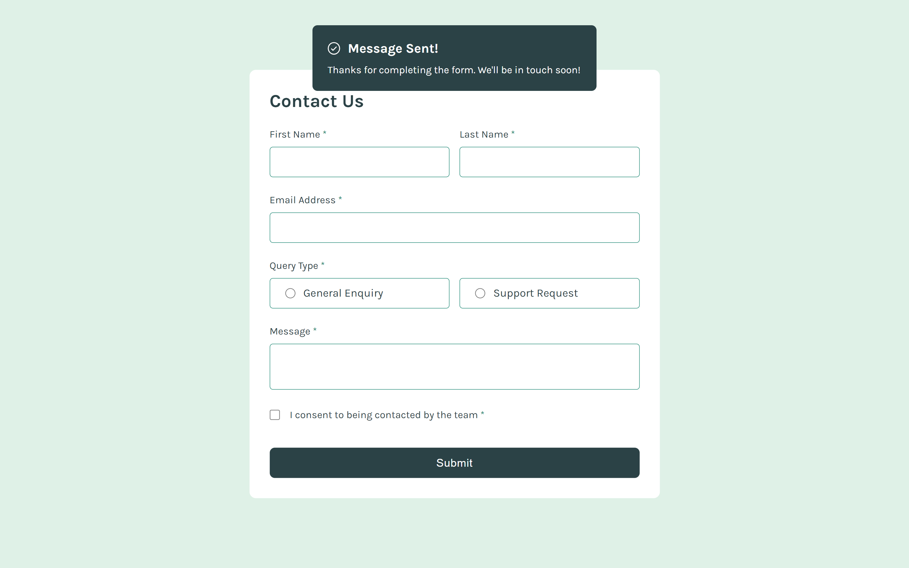
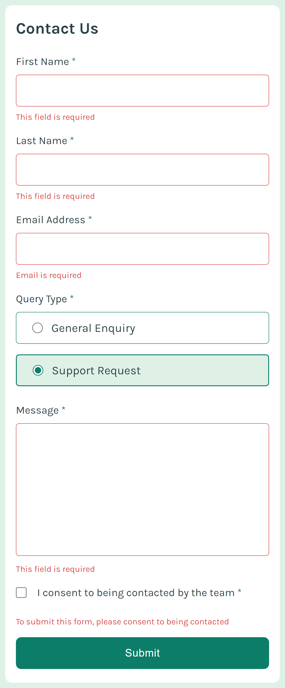

# Frontend Mentor - Multi-step form solution

This is a solution to the [Multi-step form challenge on Frontend Mentor](https://www.frontendmentor.io/challenges/multistep-form-YVAnSdqQBJ). Frontend Mentor challenges help you improve your coding skills by building realistic projects. 

## Screenshot

### Links

- Solution URL: [Click to view Solution](https://www.frontendmentor.io/solutions/responsive-multistep-form-page-CcFKSaxcWY)
- Live Site URL: [Click to view Live Site](https://coded-by-mj.github.io/Front-end-Mentor-Challenge10/)

## My process

### Built with
- Semantic HTML5 markup
- CSS
- JQuery
- Mobile First Workflow

## Author

- Frontend Mentor - [@Coded-by-MJ](https://www.frontendmentor.io/profile/Coded-by-MJ)
- Twitter - [@MiracleJustice_](https://twitter.com/miraclejustice_)
